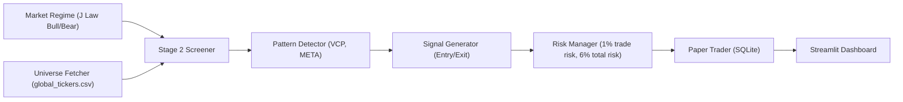

# Azalyst-Stock-Intelligence

Azalyst Stock Intelligence is an advanced quantitative research platform designed to capture global equity trends using the **J Law trading method**. By synthesizing Stage 2 trend analysis, Volatility Contraction Patterns (VCP), and M.E.T.A. pullbacks across worldwide tickers, Azalyst provides an objective, cross-validated edge for global stock strategy execution.

The platform operates a fully autonomous paper trading pipeline from discovery to risk-adjusted simulation, delivering actionable macro intelligence via an interactive dashboard.

## The Azalyst Edge

- **J Law Methodology Integration**: Operates based on strict J Law rules, detecting Stage 2 trends, VCP breakouts, and M.E.T.A. pullbacks before capital deployment.
- **Regime-Conditional Trading**: Market regime filter dynamically evaluates broad market conditions (e.g., golden crosses, powerful rallies, extreme oversold levels) and executes only in a confirmed Bull market.
- **Global Universe**: Scans global equities (US, HK, EU, JP, etc.) natively utilizing the yfinance engine, allowing diversified geographical discovery.
- **Institutional Execution Fidelity**: Realistic paper trading engine models portfolio risk with 1% per trade risk capping and a maximum portfolio open risk of 6%.

## Supported Markets

The classification engine actively monitors and routes signals across a global universe defined in `global_tickers.csv`, including:
- United States (NYSE, NASDAQ)
- Hong Kong (HKEX)
- Europe (LSE, Xetra, BME, SIX)
- Japan (TSE)
- South Korea (KRX)

## Architecture

```
 ╔══════════════════════════════════════════════════════════════════╗
 ║                 AZALYST STOCK INTELLIGENCE                       ║
 ║                 global alpha · free data · paper-traded          ║
 ╚══════════════════════════════════════════════════════════════════╝

           ┌── DASHBOARD ──┐
           │ Streamlit App │
           └──────┬────────┘
                  │
        ┌─────────┴─────────┐
        ▼                   ▼
  ┌────────────┐   ┌─────────────────────┐
  │ REGIME     │   │ UNIVERSE FETCHER    │
  │ ──────     │   │ ──────────────────  │
  │ Bull/Bear  │   │ Global tickers via  │
  │ Detect     │   │ yfinance            │
  └─────┬──────┘   └─────────┬───────────┘
        │                    │
        └─────────┬──────────┘
                  ▼
  ┌──────────────────────────────────────────┐
  │            STAGE 2 SCREENER              │
  │  ─────────────────────────────────────── │
  │  Price > 50/150/200 MA · 150 > 200 MA    │
  │  Near 52w High · Volume & Price Filters  │
  └──────────────────┬───────────────────────┘
                     │
                     ▼
  ╭──────────────────────────────────────────╮
  │   ▌▌▌  PATTERN DETECTOR (J LAW)  ▌▌▌     │
  ├──────────────────────────────────────────┤
  │   ①  VCP Breakout                        │
  │   ②  M.E.T.A. Pullback to BOL            │
  ╰──────────────────┬───────────────────────╯
                     │
                     ▼   
  ┌──────────────────────────────────────────┐
  │  SIGNAL GENERATOR                        │
  │  Buy signals for breakouts/pullbacks     │
  │  Sell into Strength/Weakness exits       │
  └──────────────────┬───────────────────────┘
                     ▼
  ┌──────────────────────────────────────────┐
  │  RISK MANAGER                            │
  │  1% Risk / Trade · 6% Total Open Risk    │
  └──────────────────┬───────────────────────┘
                     ▼
  ┌──────────────────────────────────────────┐
  │  PAPER TRADER (SQLite)                   │
  │  Trade log, positions, cash management   │
  └──────────────────────────────────────────┘
```

The mermaid version below is the same flow rendered live by GitHub:



## Strategy Rules (J Law Method)

- **Market Regime**: Only buy in a Bull market (golden cross, powerful rally, etc.)
- **Stock Selection**: Stage 2 (price > 50/150/200 MA, 150>200 MA, near 52w high, RS line strong)
- **Entry**: VCP breakout or pullback to M.E.T.A. (multiple edges)
- **Exit**: Sell into Strength at resistance; Sell into Weakness if breaks 20MA
- **Risk**: 1% per trade; max 6% total; tight stops

## Autonomous Deployment (Local Run)

Azalyst Stock Intelligence runs locally using Streamlit.

### 1. Install Dependencies
```bash
pip install -r requirements.txt
```

### 2. Configure Universe
Edit `global_tickers.csv` with your universe (a sample covering US, HK, EU, and JP markets is provided). Add any ticker that yfinance supports.

### 3. Run the Dashboard
```bash
streamlit run app.py
```

## Paper Trading
- Starts with $100,000 virtual cash.
- Trades are stored in `database/paper_trades.db`.
- Reset by deleting the database file.

## Dashboard Features
- **Market Overview**: See regime conditions and benchmark tracking.
- **Screener**: Run the Stage 2 screener to get the active watchlist.
- **Signals**: View buy/sell signals for the watchlist and execute them via paper trading.
- **Positions**: Track your open positions and P&L.
- **Trade Log**: Full history of all executed trades.
- **Execute Trades**: Manually enter custom trades.

## Core Philosophies

- **Objective Transparency**: Deterministic pattern and regime rules prioritized over subjective trading.
- **Execution Realism**: Strategy execution respects portfolio sizing and max risk rules.
- **Global Reach**: Designed to capture trend strength wherever it occurs globally.

## License

MIT

---

<div align="center">

Built by [Azalyst](https://github.com/gitdhirajsv/Azalyst-Alpha-Research-Engine) | Azalyst Alpha Quant Research

*"Evidence over claims. Always."*

</div>
