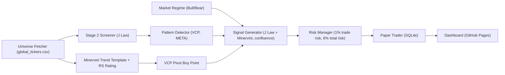

# Azalyst-Stock-Intelligence

Azalyst Stock Intelligence is an advanced quantitative research platform designed to capture global equity trends using **two independent, complementary strategies**: the **J Law trading method** and the **Mark Minervini SEPA / Trend Template**. By synthesizing Stage 2 trend analysis, Volatility Contraction Patterns (VCP), and M.E.T.A. pullbacks across worldwide tickers — and cross-confirming with Minervini's 8-point Trend Template and pivot buy points — Azalyst provides an objective, cross-validated edge for global stock strategy execution.

The platform operates a fully autonomous paper trading pipeline from discovery to risk-adjusted simulation, delivering actionable macro intelligence via an interactive dashboard.

Live Intelligence Dashboard: [https://gitdhirajsv.github.io/Azalyst-Stock-Intelligence/](https://gitdhirajsv.github.io/Azalyst-Stock-Intelligence/)

## The Azalyst Edge

- **Dual-Strategy Signals (J Law + Minervini)**: Two engines run every scan. The **J Law** path screens the Stage-2 watchlist for VCP breakouts and M.E.T.A. pullbacks. The **Mark Minervini** path independently screens the *entire* universe against the 8-point Trend Template (SEPA) and only fires at a valid **VCP pivot buy point** — i.e. a fresh breakout inside the buy zone (≤5% above the pivot) on ≥1.4× average volume, with a protective stop below the base (≤8% risk). Every signal is tagged with its `source` (`JLAW` / `MINERVINI`); when both agree on a ticker it is merged into a high-conviction **confluence** signal.
- **At-the-Buy-Price Discipline**: Minervini signals are suppressed once a stock is extended (>5% above the pivot), so a fired signal is always actionable at a low-risk entry — built for real-time buying.
- **J Law Methodology Integration**: Operates based on strict J Law rules, detecting Stage 2 trends, VCP breakouts, and M.E.T.A. pullbacks before capital deployment.
- **Regime-Conditional Trading**: Market regime filter dynamically evaluates broad market conditions (e.g., golden crosses, powerful rallies, extreme oversold levels) and executes only in a confirmed Bull market.
- **Global Universe**: Scans global equities (US, HK, EU, JP, etc.) natively utilizing the yfinance engine, allowing diversified geographical discovery.
- **Institutional Execution Fidelity**: Realistic paper trading engine models portfolio risk with 1% per trade risk capping and a maximum portfolio open risk of 6%.

## Supported Markets

The classification engine actively monitors and routes signals across a global universe defined in `global_tickers.csv`, including:
- United States (NYSE, NASDAQ)
- Hong Kong (HKEX)
- Europe (LSE, Xetra, BME, SIX)
- Japan (TSE)
- South Korea (KRX)

## Architecture

```
 ╔══════════════════════════════════════════════════════════════════╗
 ║                 AZALYST STOCK INTELLIGENCE                       ║
 ║                 global alpha · free data · paper-traded          ║
 ╚══════════════════════════════════════════════════════════════════╝

           ┌── DASHBOARD ──┐
           │ Streamlit App │
           └──────┬────────┘
                  │
        ┌─────────┴─────────┐
        ▼                   ▼
  ┌────────────┐   ┌─────────────────────┐
  │ REGIME     │   │ UNIVERSE FETCHER    │
  │ ──────     │   │ ──────────────────  │
  │ Bull/Bear  │   │ Global tickers via  │
  │ Detect     │   │ yfinance            │
  └─────┬──────┘   └─────────┬───────────┘
        │                    │
        └─────────┬──────────┘
                  ▼
  ┌──────────────────────────────────────────┐
  │            STAGE 2 SCREENER              │
  │  ─────────────────────────────────────── │
  │  Price > 50/150/200 MA · 150 > 200 MA    │
  │  Near 52w High · Volume & Price Filters  │
  └──────────────────┬───────────────────────┘
                     │
                     ▼
  ╭──────────────────────────────────────────╮
  │   ▌▌▌  PATTERN DETECTOR (J LAW)  ▌▌▌     │
  ├──────────────────────────────────────────┤
  │   ①  VCP Breakout                        │
  │   ②  M.E.T.A. Pullback to BOL            │
  ╰──────────────────┬───────────────────────╯
                     │
                     ▼   
  ┌──────────────────────────────────────────┐
  │  SIGNAL GENERATOR                        │
  │  Buy signals for breakouts/pullbacks     │
  │  Sell into Strength/Weakness exits       │
  └──────────────────┬───────────────────────┘
                     ▼
  ┌──────────────────────────────────────────┐
  │  RISK MANAGER                            │
  │  1% Risk / Trade · 6% Total Open Risk    │
  └──────────────────┬───────────────────────┘
                     ▼
  ┌──────────────────────────────────────────┐
  │  PAPER TRADER (SQLite)                   │
  │  Trade log, positions, cash management   │
  └──────────────────────────────────────────┘
```

The mermaid version below is the same flow rendered live by GitHub:


```mermaid
flowchart LR
    REG["Market Regime (Bull/Bear)"] --> SG
    UF["Universe Fetcher (global_tickers.csv)"] --> SC["Stage 2 Screener (J Law)"]
    UF --> MTT["Minervini Trend Template + RS Rating"]
    SC --> PD["Pattern Detector (VCP, META)"]
    PD --> SG["Signal Generator (J Law + Minervini, confluence)"]
    MTT --> PV["VCP Pivot Buy Point"]
    PV --> SG
    SG --> RM["Risk Manager (1% trade risk, 6% total risk)"]
    RM --> PT["Paper Trader (SQLite)"]
    PT --> DASH["Dashboard (GitHub Pages)"]
```

## Strategy Rules

### J Law Method
- **Market Regime**: Only buy in a Bull market (confirmed uptrend: price > 200MA, golden cross, 200MA rising).
- **Stock Selection**: Stage 2 (price > 50/150/200 MA, 150>200 MA, near 52w high, RS line strong).
- **Entry**: VCP breakout or pullback to M.E.T.A. (multiple edges).
- **Exit**: Sell into Strength at resistance; Sell into Weakness if breaks 20MA.
- **Risk**: 1% per trade, bounded so an 8% adverse gap costs no more than 1.5% of equity (see Remediation Pass below); max 6% total open risk, actually enforced; tight stops, persisted with the position and checked against the day's Low every cycle.

### Mark Minervini Trend Template (SEPA)
Runs independently over the full universe. A stock must pass **all 8** criteria *simultaneously*:
1. Price above both the 150-day and 200-day SMA.
2. 150-day SMA above the 200-day SMA.
3. 200-day SMA trending up for ≥ ~1 month.
4. 50-day SMA above both the 150- and 200-day SMA.
5. Price above the 50-day SMA.
6. Price ≥ **30%** above its 52-week low.
7. Price within **25%** of its 52-week high.
8. IBD-style **RS Rating ≥ 70** (universe-wide percentile, momentum-weighted 2·Q1 + Q2 + Q3 + Q4).

**Buy point**: fires only on a fresh **VCP pivot breakout** inside the buy zone (pivot → ≤5% above), on ≥1.4× 50-day average volume, with a protective stop below the final-contraction low. If the structural stop implies > 8% risk (or the stock is extended), the signal is **rejected** rather than chased. Entry = the executable price at the pivot breakout; target = 3R.

## Autonomous Deployment (Local Run)

Azalyst Stock Intelligence runs locally using Streamlit.

### 1. Install Dependencies
```bash
pip install -r requirements.txt
```

### 2. Configure Universe
Edit `global_tickers.csv` with your universe (a sample covering US, HK, EU, and JP markets is provided). Add any ticker that yfinance supports.

### 3. Run the Pipeline / Dashboard
```bash
python azalyst.py            # runs the screen + signal + risk + paper-trade cycle
python generate_dashboard.py # regenerates status.json for the published dashboard
```
`.github/workflows/run_azalyst.yml` runs both on a schedule and publishes the result to GitHub Pages; there is no local Streamlit app in this repo (a prior version of this README referenced one — corrected 2026-07-28).

## Paper Trading
- Starts with $100,000 virtual cash.
- Trades are stored in `database/paper_trades.db`.
- Reset by archiving the current database + `status.json` under `archive/vN_paper_track_record_<date>/` (matching the ETF repo's convention), then deleting the database file so `init_db()` recreates a fresh one. Do not just delete without archiving — the forensic audit that produced the 2026-07-28 remediation pass found undisciplined resets are exactly what erodes trust in a public paper-trading record.

## Dashboard Features
- **Market Overview**: See regime conditions and benchmark tracking.
- **Screener**: Run the Stage 2 screener to get the active watchlist.
- **Signals**: View buy/sell signals for the watchlist and execute them via paper trading.
- **Positions**: Track your open positions and P&L.
- **Trade Log**: Full history of all executed trades.
- **Execute Trades**: Manually enter custom trades.

## Core Philosophies

- **Objective Transparency**: Deterministic pattern and regime rules prioritized over subjective trading.
- **Execution Realism**: Strategy execution respects portfolio sizing and max risk rules.
- **Global Reach**: Designed to capture trend strength wherever it occurs globally.

## Remediation Pass (2026-07-28)

A forensic audit of the live engine found seven defects severe enough to invalidate the paper track record on their own. All seven are fixed; the pre-fix book (including a closed RCUS trade, -$2,519.30 / -10.08%, and the PACS/CNC/ROIV/KYMR positions opened under the old rules) is archived at `archive/v1_paper_track_record_2026-07-28/`, and the database was reset to a fresh $100,000 starting balance so the new rules can be judged on a clean ledger.

1. **Stop persistence.** `execute_trade()` had no `stop_loss` parameter — every open position's stop was `NULL` in the database, discarded the instant the trade was booked despite being computed at entry. Now persisted, and a top-up keeps the original stop rather than overwriting it.
2. **Stop enforcement.** The only live exit was a hardcoded "Dummy exit rule" (`avg_price * 0.92`) checked against the day's *Close* only — a stop could be touched intraday, recover by the close, and never trigger. Now checks the persisted stop against the day's *Low*, with a gap-aware fill (fills at the Open if the session gapped below the stop, never at a price nobody could get).
3. **Position sizing.** `shares = (equity*1%) / |entry - stop|`, capped only at 25% of equity — any stop tighter than 4% (which the J-Law pullback entry structurally produces) ballooned every trade to that 25% cap regardless of the stop's own tightness. Now also bounded so an assumed 8% adverse gap costs no more than 1.5% of equity, and a stop at or above entry (see #6) is rejected outright instead of masked by `abs()`.
4. **Aggregate risk and diversification.** `total_risk_ok` existed but was never called, and had a bug that would have crashed it anyway (iterating a DataFrame's column names instead of its rows). No position-count or sector cap existed at all — the live book ended up 3 of 4 positions in healthcare/biotech by accident. Now wired in, plus `MAX_OPEN_POSITIONS=8` and `MAX_POSITIONS_PER_SECTOR=2`.
5. **Inverted-stop signal bug.** The J-Law pullback branch used a fixed `stop = pivot * 0.97` regardless of how far the pullback had actually moved from the pivot — a pullback qualifying via MA support and volume contraction alone (2 of 4 required "edges") could sit well below the pivot, putting the stop *above* the entry price. This was live: a signal for AMN priced entry at 33.45 with a stop of 34.66. Fixed at the source, plus a blanket validation pass that rejects any signal (from either strategy) with `stop >= price`.
6. **Dashboard honesty.** `status.json` hardcoded realized P&L to "$0.00" and never recomputed it — the closed RCUS loss above showed as zero everywhere a viewer would check. Now computed via FIFO BUY/SELL matching.
7. **Decision cadence.** The cron ran this pipeline hourly during market hours using daily-interval bars — mid-session, "the last bar" is today's still-forming candle, so a breakout "confirmed" at 10:30am ET could fail by the close. Entries are now evaluated only outside market hours (against a completed bar); stop-loss monitoring still runs every cycle.

All seven fixes ship with regression tests in `tests/` (this repo had none before) that fail against the pre-fix code and pass against the fix, several verified directly against this repo's own live database.

## License

MIT

---

<div align="center">

Built by [Azalyst](https://github.com/gitdhirajsv/Azalyst-Alpha-Research-Engine) | Azalyst Alpha Quant Research

*"Evidence over claims. Always."*

</div>
